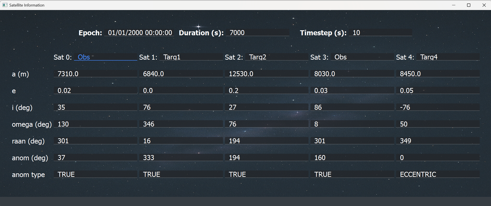
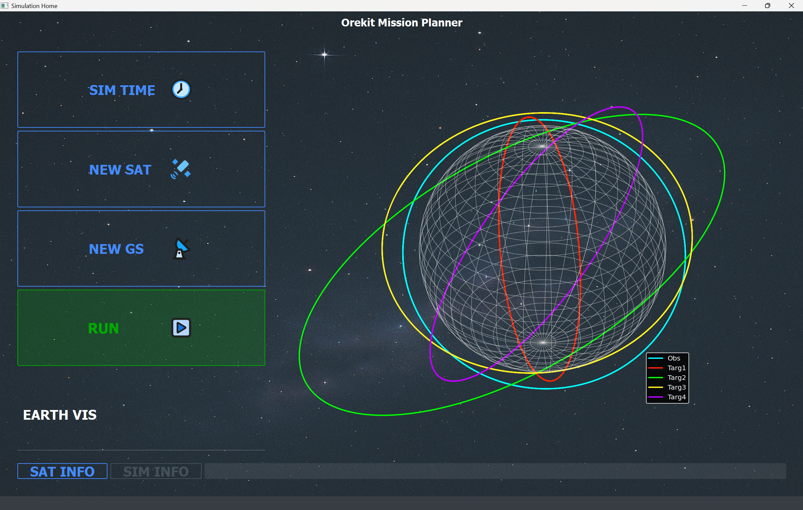
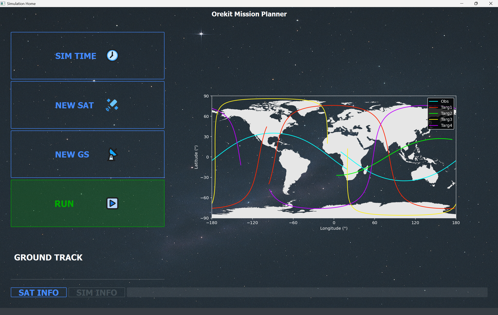

# 🛰️ Mission Planner

A satellite mission planning application developed in Python with a full custom PyQt5 GUI for desktop. This project focuses on integrating satellite orbit propagation, ground station visibility, attitude manoeuvres and 3D visualization tools together under one intuitive interface

---

## 🎥 Demo

https://github.com/PatoGranate/Mission-Planner/assets/demo.mp4

> If the video does not autoplay, [click here to download or view it](https://raw.githubusercontent.com/PatoGranate/Mission-Planner/main/assets/demo.mp4)

---

## ✨ Features

- **Satellite Management** – Define orbital parameters and simulate satellite motion
- **Ground Station Support** – Add, edit and visualize multiple grounds stations with precise geolocation control
- **Visibility Conflict Resolution** – Resolves overlapping satellite passes using priority logic (initial version; in development)
- **3D Orbit Visualization** – Propagation of orbits in real-time over a wireframe Earth model
- **Mission Receipt** – Computes required target/nadir pointing manoeuvres and identifies satellite visibility from observer
- **Modular Design** – Clean separation between model, GUI, and orchestration layers

---

## 📷 Screenshots

| Satellite Information | 3D Orbit View | Ground Track View |
|-----------------------|---------------|-------------------|
|  |  |  |

> Additional images show functionality with up to 5 ground stations and satellites simultaneously.

---

## 🗂️ Project Structure
```
Mission-Planner/
├── data/             # Orekit data
├── documentation/    # Documentation on parts of code
├── imgs/             # Background image, map, icons etc.
├── src/              # Source code
│ ├── gui/            # UI components (PyQt5) and model integration
│ ├── model/          # Core logic for satellites, ground stations and calculations
│ └── runner/         # Main project launcher
├── assets/           # Demo video and images
└── README.md
```

---

## 🛠️ Tech Stack

| Tool/Library    | Purpose                            |
|----------------|-------------------------------------|
| Python 3.10     | Core programming language          |
| PyQt5           | GUI framework                      |
| Matplotlib 3D   | 2D and 3D satellite and Earth plotting    |
| Orekit (via jpype) | Orbit dynamics and vector handling |
| Qt Designer     | UI prototyping and design          |
| NumPy           | Scientific computing               |

---

## Explore

Explore core parts of the project through:

- `src/gui/` — MainWindow, subwindows, tab layout
- `src/model/` — Orbital propagation using Orekit
- `src/controller/` — Logic that handles button presses, data input, and plot updates

---

## Contact

Feel free to reach out if you'd like to discuss this project or my process:

- GitHub: [@PatoGranate](https://github.com/PatoGranate)
- Email: *pelayo.cabrerizo@gmail.com*

---

## 📄 License

Most of this project was developed as part of at internship an [SuperSharp Space](https://www.supersharp.space/) and is intended solely for internal use and portfolio demonstration.  
It is **not licensed for public distribution or reuse**.
